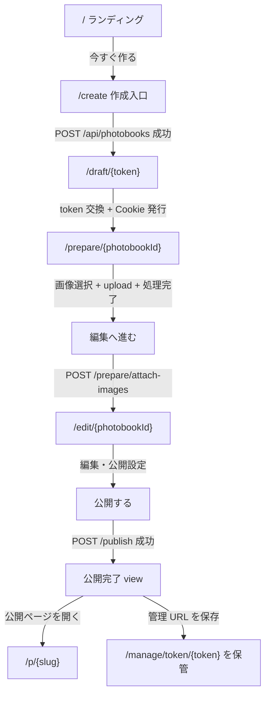
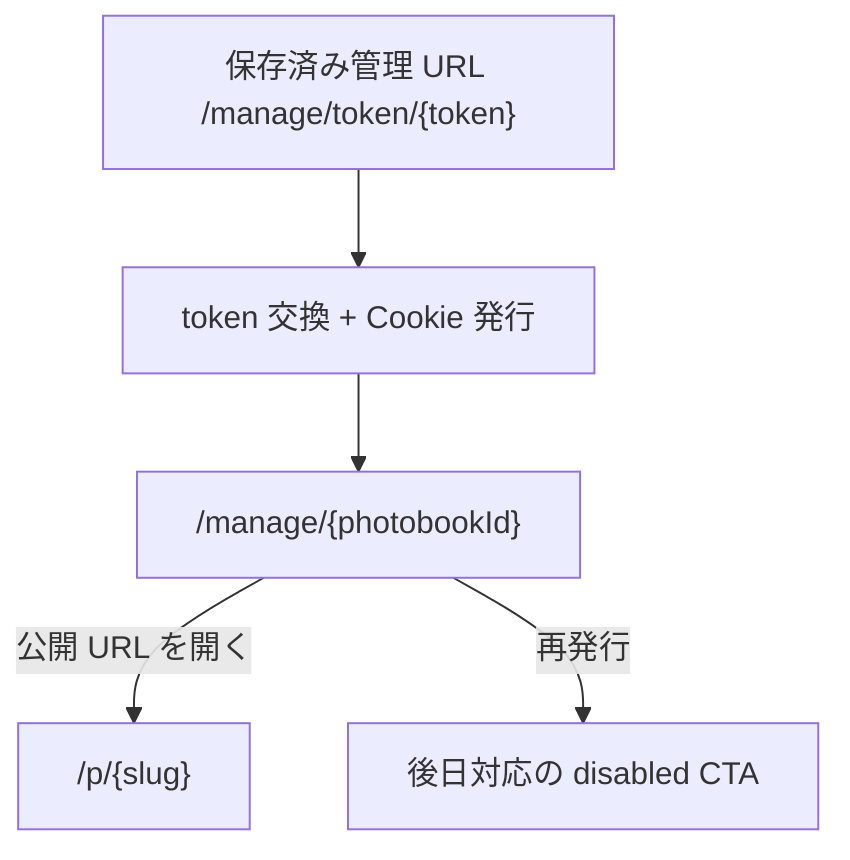
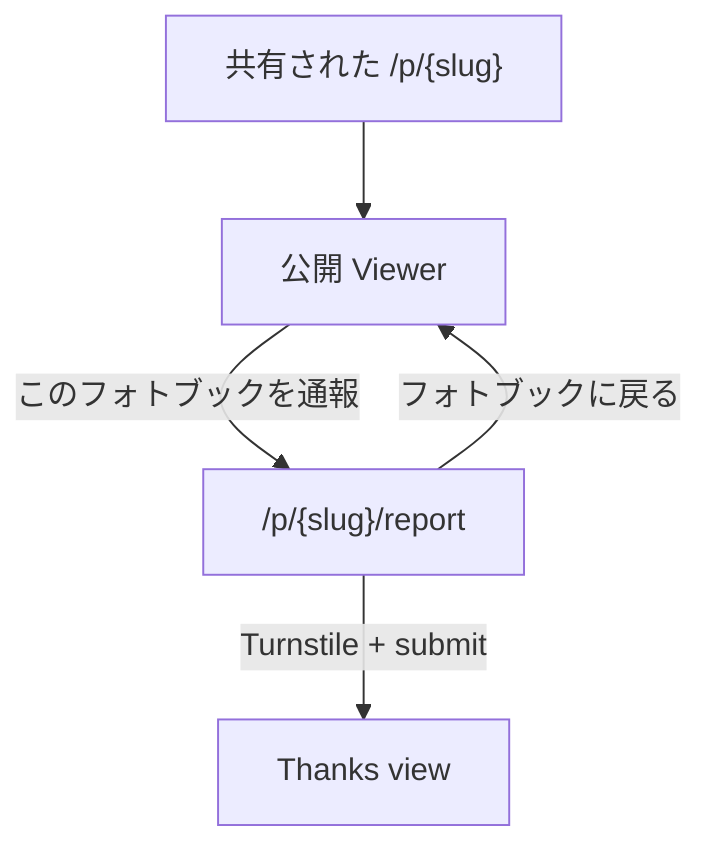

# VRC PhotoBook ワイヤーフレーム設計ブリーフ

最終確認日: 2026-05-03

対象: `frontend/app` 実装済み画面、主要 API、公開 / 下書き / 管理 URL 導線

この文書は、Figma 等でワイヤーフレームを作るための画面構成・導線・状態の整理です。見た目の正典は `design/design-system/`、探索モックは `design/mockups/prototype/`、業務仕様の正典は `docs/spec/vrc_photobook_business_knowledge_v4.md` を参照してください。

## 1. サービス概要

VRC PhotoBook は、VRChat 写真をログイン不要で 1 冊のフォトブックにまとめるサービスです。アカウントログインはなく、作成中は draft URL、公開後は管理 URL を使って権限を持ちます。

主要ユーザー:

- 作成者: フォトブックを作成、画像追加、編集、公開、管理 URL を保存する
- 閲覧者: 公開 URL からフォトブックを見る、必要に応じて通報する
- 運営者: MVP では Web 管理画面なし。`cmd/ops` CLI で通報対応・非表示等を行う

## 2. 全体ページマップ

| 区分 | URL | 画面 / 処理 | 主な役割 | 認可 |
|---|---|---|---|---|
| Public | `/` | ランディング | サービス説明、作成導線、規約類への導線 | 不要 |
| Public | `/create` | 作成入口 | タイプ選択、任意タイトル、任意作成者名、Turnstile | 不要 |
| Token | `/draft/{token}` | draft token 交換 | draft token を session Cookie に交換し `/prepare/{photobookId}` へ redirect | raw token |
| Draft | `/prepare/{photobookId}` | 写真一括追加 | 複数画像アップロード、処理待ち、編集画面へ進む | draft session |
| Draft | `/edit/{photobookId}` | 編集 | ページ / 写真 / キャプション / 表紙 / 公開設定 / 公開 | draft session |
| Draft | edit 内 state | 公開完了 | 公開 URL と管理 URL の表示、管理 URL 保存 | draft session 直後 |
| Token | `/manage/token/{token}` | manage token 交換 | manage token を session Cookie に交換し `/manage/{photobookId}` へ redirect | raw token |
| Manage | `/manage/{photobookId}` | 管理ページ | 公開 URL、状態、写真数、管理リンク情報表示 | manage session |
| Public | `/p/{slug}` | 公開 Viewer | フォトブック閲覧、通報導線 | 不要 |
| Public | `/p/{slug}/report` | 通報 | 通報理由、詳細、連絡先、Turnstile、送信完了 | 不要 |
| Public | `/about` | About | サービス説明、できること / できないこと | 不要 |
| Public | `/help/manage-url` | 管理 URL FAQ | 管理 URL の保存・紛失・メール未提供案内 | 不要 |
| Public | `/terms` | 利用規約 | 規約本文 | 不要 |
| Public | `/privacy` | プライバシーポリシー | ポリシー本文 | 不要 |
| System | `/ogp/{photobookId}` | OGP image proxy | SNS preview 用画像配信 | 不要 |

全ページは MVP では `noindex, nofollow`。`/draft`、`/manage`、`/edit` は referrer 漏洩対策対象です。

## 3. 主要導線

### 3.1 作成から公開まで

### 3.2 公開後の管理

### 3.3 閲覧者と通報

### 3.4 静的情報ページ導線

- `/` から `/create`、`/about`、`/help/manage-url`、`/terms`、`/privacy`
- `/about` から `/terms`、`/privacy`、`/help/manage-url`
- `/terms` から `/help/manage-url`
- `/privacy` から `/terms`
- 公開完了 view footer から `/help/manage-url`

## 4. 画面別ワイヤーフレーム要件

### 4.1 `/` ランディング

目的: 初回ユーザーに価値を伝え、作成開始または説明ページへ送る。

主要要素:

- Hero: `VRC PhotoBook` eyebrow、H1「VRChat 写真を、ログイン不要で 1 冊に。」
- Primary CTA: `今すぐ作る` -> `/create`
- Secondary CTA: `VRC PhotoBook について` -> `/about`
- Secondary CTA: `管理 URL の使い方` -> `/help/manage-url`
- サンプル MockBook / thumb strip
- 特徴カード 4 件: ログイン不要、管理 URL で編集、公開範囲、通報窓口
- ポリシー導線: `/terms`、`/privacy`
- 下部 CTA: `/create`、`/about`
- Footer: 共通 footer + trust strip

状態:

- `reason=invalid_draft_token` または `reason=invalid_manage_token` 付きで戻る可能性あり。現状専用表示は未実装。

### 4.2 `/create` 作成入口

目的: server draft を作り、draft URL 消費へ進める。

主要要素:

- H1「どんなフォトブックを作りますか？」
- タイプ選択 radio 7 種: `memory`、`event`、`daily`、`portfolio`、`avatar`、`world`、`free`
- 任意入力: タイトル 最大 100 文字
- 任意入力: 作成者の表示名 最大 50 文字
- 既定公開範囲の説明: 限定公開
- Turnstile widget: action `photobook-create`
- Submit: `編集を始める`

リンク / 遷移:

- Submit 成功: `POST /api/photobooks` -> response の `draft_edit_url_path` へ `window.location.replace`
- その後 `/draft/{token}` が session 化し `/prepare/{photobookId}` へ redirect

状態:

- Turnstile site key 未設定: server error 表示
- Submit disabled: Turnstile 未完了、送信中
- Error: invalid payload、Turnstile failed / unavailable、network、server error

### 4.3 `/draft/{token}` token 交換

目的: URL 上の raw draft token を短命 Cookie session に変換して URL から消す。

画面ではなく Route Handler。

処理:

- Backend `POST /api/auth/draft-session-exchange`
- `Set-Cookie: vrcpb_draft_{photobookId}=...`
- `Cache-Control: no-store`
- 成功 redirect: `/prepare/{photobookId}`
- 失敗 redirect: `/?reason=invalid_draft_token`

ワイヤーフレーム上の扱い:

- ローディング画面は不要。即時 redirect の中継ノードとしてサイトマップに入れる。

### 4.4 `/prepare/{photobookId}` 写真一括追加

目的: 画像をまとめて追加し、サーバー処理完了後に編集画面へ進める。

主要要素:

- H1「写真をまとめて追加」
- 説明: JPEG / PNG / WebP、最大 10MB / 枚、最大 20 枚、HEIC / HEIF 未対応
- Turnstile widget: action `upload`
- File input: multiple、Turnstile 完了後に有効
- 進捗パネル: 完了 / 合計、処理中、失敗
- 遅延 notice: 通常 1-2 分、10 分超は混雑 notice
- 画像 tile grid: 2 columns mobile、3-4 columns larger
- Primary CTA: `編集へ進む`

リンク / 遷移:

- `編集へ進む`: `POST /api/photobooks/{id}/prepare/attach-images` -> `/edit/{photobookId}`

状態:

- SSR 認可 / 取得失敗: unauthorized、not found、server error
- Turnstile 未完了: file input disabled
- 上限到達: 20 枚まで notice
- Upload tile states: queued、verifying、uploading、completing、processing、available、failed
- 失敗理由表示: verification failed、rate limited、validation、upload failed、complete failed、network、unknown
- CTA disabled: 処理中、対象画像なし、進行中
- Reload 復元: server 側 images を merge して進捗復元

### 4.5 `/edit/{photobookId}` 編集

目的: フォトブック本文を編集し、公開する。

主要要素:

- Header: `編集ページ`、version 表示
- Conflict banner: `最新を取得`
- 処理中 / 失敗 count banner
- ページ一覧
- 各ページの PhotoGrid
- 写真ごとの操作: caption 保存、上へ / 下へ / 先頭 / 末尾、表紙に設定、表紙解除、削除
- 空ページ状態: `最初のページを追加`
- 1 枚追加 fallback: file input、Turnstile、`アップロード開始`
- CoverPanel: 表紙 preview、cover title、解除
- PublishSettingsPanel: タイトル、説明、タイプ、レイアウト、opening style、公開範囲、権利・配慮同意、保存、公開
- `ページを追加`

リンク / 遷移:

- `公開する`: `POST /api/photobooks/{id}/publish`
- 成功時は同じ React state 内で公開完了 view に切替
- 公開完了後 `編集ページに戻る` は `/` へ移動。公開後 draft session は失効するため edit へ戻らない。

状態:

- SSR 認可 / 取得失敗: unauthorized、not found、server error
- Version conflict: 操作停止、`最新を取得` CTA
- Unauthorized: draft URL から入り直し案内
- Publish precondition failed:
  - rights not agreed: 同意チェック要求
  - not draft: 既に公開済み等
  - empty title: タイトル入力要求
  - empty creator: 現 UI では修正不可メッセージ
- Publish rate limited: 再試行時間表示
- Upload fallback states: selected、verifying、uploading、completing、processing、error
- Processing count > 0: 5 秒 polling

### 4.6 公開完了 view

目的: 公開 URL を共有させ、管理 URL を必ず保存させる。

主要要素:

- Header: `公開完了`、H1「フォトブックを公開しました」
- Public URL copy panel
- Manage URL warning
- Manage URL copy panel: `管理用 URL（再表示できません）`
- 保存方法 panel:
  - `.txt ファイルとして保存`
  - `自分宛にメールを書く` (`mailto:`)
  - `管理用 URL を安全な場所に保存しました` checkbox
- Actions:
  - `公開ページを開く` -> `/p/{slug}` を新規タブ
  - `編集ページに戻る` -> `/`
- 保存未確認 reminder
- FAQ link: `/help/manage-url`

重要制約:

- 管理 URL は raw token を含むため、再表示不可の前提で 1 回だけ見せる。
- localStorage / sessionStorage には保存しない。

### 4.7 `/manage/token/{token}` token 交換

目的: 管理 URL 上の raw token を短命 Cookie session に変換して URL から消す。

画面ではなく Route Handler。

処理:

- Backend `POST /api/auth/manage-session-exchange`
- `Set-Cookie: vrcpb_manage_{photobookId}=...`
- `Cache-Control: no-store`
- 成功 redirect: `/manage/{photobookId}`
- 失敗 redirect: `/?reason=invalid_manage_token`

### 4.8 `/manage/{photobookId}` 管理ページ

目的: 公開済みフォトブックの状態と公開 URL を確認する。

主要要素:

- Header: `管理ページ`、タイトル
- 状態: draft / published / deleted、hidden badge
- HiddenByOperatorBanner: 運営により一時非表示の場合
- 公開 URL row: `/p/{slug}`。未公開なら dashed empty state
- 情報 panel:
  - 公開写真の数
  - 公開設定
  - 管理リンクのバージョン
  - 公開日時
- 管理リンク再発行 panel:
  - 説明
  - disabled `再発行（後日対応）`
- Footer

リンク / 遷移:

- 公開 URL row は表示のみ。現状 copy action は ManagePanel にはない。
- 再発行は MVP 未対応。

状態:

- SSR 認可 / 取得失敗: unauthorized、not found、server error
- hidden: 公開 URL があっても閲覧側は公開不可になる可能性がある

### 4.9 `/p/{slug}` 公開 Viewer

目的: フォトブックを閲覧してもらう。

主要要素:

- Cover image
- H1: cover title または title
- Description
- Creator display name、任意 X ID
- Page ごとの PhotoGrid
- Footer
- Extra footer link: `このフォトブックを通報` -> `/p/{slug}/report`

状態:

- Backend 404: Next.js not found
- Backend 410: gone error
- Network / server: server error
- private / hidden / deleted / purged / draft は公開 Viewer 側では到達不可として扱う

OGP:

- `/ogp/{photobookId}?v=1` を metadata に設定
- lookup 失敗時は `/og/default.png`

### 4.10 `/p/{slug}/report` 通報

目的: 閲覧者が問題を運営に送る。

主要要素:

- Header: `通報`、H1「{title} を通報」
- Back link: `/p/{slug}`
- Reason select 6 種:
  - 嫌がらせ・晒し
  - 無断転載の可能性
  - 被写体として削除希望
  - センシティブ設定の不足
  - 年齢・センシティブに関する問題
  - その他
- Detail textarea: 任意、最大 2000 文字
- Contact input: 任意、最大 200 文字
- Turnstile widget: action `report-submit`
- Submit: `通報を送信`
- Success state: thanks view、report id は表示しない

状態:

- Turnstile site key 未設定: server error
- 対象取得失敗: not found、gone、server error
- Submit disabled: Turnstile 未完了、送信中
- Error: invalid payload、Turnstile failed、not found、rate limited、network / server

### 4.11 `/about`

目的: サービス説明と MVP の範囲を伝える。

主要要素:

- Header: About
- サービスの位置づけ card
- できること 6 件
- MVP ではできないこと 4 件
- ポリシーと窓口:
  - `/terms`
  - `/privacy`
  - `/help/manage-url`
  - 通報は Viewer から
- Footer + trust strip

### 4.12 `/help/manage-url`

目的: 管理 URL の保存・紛失・再表示不可を説明する。

主要要素:

- FAQ sections:
  - 公開 URL と管理用 URL の違い
  - 管理用 URL は再表示不可
  - 紛失時は編集 / 公開停止不可
  - 保存方法
  - メール送信機能は現在なし
  - 外部共有禁止
- Footer

### 4.13 `/terms`

目的: 利用規約。

主要要素:

- Header: Terms、最終更新
- Notice
- TOC
- Article 1-9
- Link: `/help/manage-url`
- 外部 X link
- Footer

### 4.14 `/privacy`

目的: プライバシーポリシー。

主要要素:

- Header: Privacy、最終更新
- Notice
- TOC
- Article 1-10
- External services chips
- Link: `/terms`
- Footer

## 5. API と画面の対応

| 画面 | API | 用途 | 成功時 UI |
|---|---|---|---|
| `/create` | `POST /api/photobooks` | draft 作成 | `/draft/{token}` へ replace |
| `/draft/{token}` | `POST /api/auth/draft-session-exchange` | draft session 発行 | `/prepare/{photobookId}` へ redirect |
| `/prepare/{id}` | `GET /api/photobooks/{id}/edit-view` | 初期表示 / polling | upload queue 復元 |
| `/prepare/{id}` | `POST /api/photobooks/{id}/upload-verifications/` | upload 前 Turnstile 検証 | verification token 取得 |
| `/prepare/{id}` | `POST /api/photobooks/{id}/images/upload-intent` | R2 presigned URL 取得 | R2 PUT へ進む |
| `/prepare/{id}` | R2 presigned URL `PUT` | 画像アップロード | complete へ進む |
| `/prepare/{id}` | `POST /api/photobooks/{id}/images/{imageId}/complete` | upload 完了通知 | processing 表示 |
| `/prepare/{id}` | `POST /api/photobooks/{id}/prepare/attach-images` | available image をページに配置 | `/edit/{id}` へ遷移 |
| `/edit/{id}` | `GET /api/photobooks/{id}/edit-view` | 初期表示 / reload / polling | 編集画面更新 |
| `/edit/{id}` | `PATCH /api/photobooks/{id}/photos/{photoId}/caption` | caption 更新 | version +1 |
| `/edit/{id}` | `PATCH /api/photobooks/{id}/photos/reorder` | 並び替え | version +1 |
| `/edit/{id}` | `PATCH /api/photobooks/{id}/cover-image` | 表紙設定 | reload |
| `/edit/{id}` | `DELETE /api/photobooks/{id}/cover-image` | 表紙解除 | reload |
| `/edit/{id}` | `PATCH /api/photobooks/{id}/settings` | 設定保存 | version +1 |
| `/edit/{id}` | `DELETE /api/photobooks/{id}/photos/{photoId}` | 写真削除 | reload |
| `/edit/{id}` | `POST /api/photobooks/{id}/pages` | ページ追加 | reload |
| `/edit/{id}` | `POST /api/photobooks/{id}/publish` | 公開 | 公開完了 view |
| `/manage/token/{token}` | `POST /api/auth/manage-session-exchange` | manage session 発行 | `/manage/{id}` へ redirect |
| `/manage/{id}` | `GET /api/manage/photobooks/{id}` | 管理情報取得 | 管理ページ表示 |
| `/p/{slug}` | `GET /api/public/photobooks/{slug}` | 公開 Viewer 表示 | Viewer 表示 |
| `/p/{slug}/report` | `GET /api/public/photobooks/{slug}` | 通報対象表示 | 通報フォーム表示 |
| `/p/{slug}/report` | `POST /api/public/photobooks/{slug}/reports` | 通報送信 | thanks view |
| OGP metadata | `GET /api/public/photobooks/{photobookId}/ogp` | OGP 取得 | image response |

## 6. 共通コンポーネント / UI パターン

- `PublicPageFooter`: Public 系ページ共通 footer。必要に応じて trust strip / extra link を持つ。
- `SectionEyebrow`: LP / About / Policy の小見出し。
- `ErrorState`: unauthorized、not found、gone、server error を集約。
- `TurnstileWidget`: create、upload、report で利用。token 未取得時は submit / file input を無効化。
- `UrlRow`: 公開 URL / 管理 URL 表示行。public は teal、manage は violet 系。
- `MockBook` / `MockThumb`: LP のサンプル表示。
- `PhotoGrid`: Edit と Viewer で別実装。Edit は操作付き、Viewer は閲覧のみ。

## 7. 認可 / token / Cookie の前提

- raw `draft_edit_token` は `/draft/{token}` の初回アクセス時だけ URL に出る。
- raw `manage_url_token` は `/manage/token/{token}` の初回アクセス時だけ URL に出る。
- Frontend Route Handler が Backend token exchange API を呼び、session token を HttpOnly Cookie として発行する。
- redirect 後は URL から raw token が消える。
- Cookie 名:
  - draft: `vrcpb_draft_{photobookId}`
  - manage: `vrcpb_manage_{photobookId}`
- Backend API への SSR fetch は Cookie header を手動転送する。
- Browser fetch は `credentials: include` を使う。
- raw token、Cookie 値、presigned URL、storage key は UI / log / docs に出さない。

## 8. エラー / 空状態の設計対象

ワイヤーフレームでは最低限、以下の状態を用意する。

- 認可切れ: draft / manage session がない、期限切れ
- Not found: photobook / slug が存在しない
- Gone: 公開ページが削除済み
- Server error: API / env / network failure
- Turnstile 未完了 / 失敗 / unavailable
- Rate limit: upload、publish、report
- Version conflict: edit 操作、attach、publish
- Processing: 画像変換中
- Failed image: 画像処理失敗
- Empty pages: ページ未作成
- Empty public URL: 未公開 manage page
- Hidden by operator: 管理ページに警告、公開 Viewer は到達不可
- Manage URL 未保存: 公開完了 view reminder

## 9. MVP 未実装 / 後日対応として描くもの

- 管理 URL のサーバー側メール送信: 未提供。公開完了 view では `.txt`、`mailto:`、コピーで代替。
- 管理 URL の Web 再発行: `/manage/{id}` に disabled placeholder。
- 運営 Web 管理画面: なし。CLI 運用。
- X ログイン / アカウント管理: なし。
- 検索エンジン掲載: なし。全 noindex。
- 公開 Viewer の type / layout 別リッチ表現: 現状は共通縦並び。将来拡張。

## 10. 推奨ワイヤーフレーム成果物

最低限作る画面:

1. `/` ランディング
2. `/create`
3. `/prepare/{photobookId}` 通常 / 処理中 / 失敗あり
4. `/edit/{photobookId}` 通常 / conflict / 空ページ
5. 公開完了 view
6. `/manage/{photobookId}` 通常 / hidden / 未公開
7. `/p/{slug}` Viewer
8. `/p/{slug}/report` 入力 / thanks / error
9. `/about`
10. `/help/manage-url`
11. `/terms`
12. `/privacy`
13. 共通 ErrorState: unauthorized / not found / gone / server error

導線図として必ず含めるもの:

- 作成から公開までの primary flow
- draft token exchange と manage token exchange
- 公開 Viewer から通報
- 公開完了 view から公開 URL / 管理 URL 保存
- 静的情報ページ間のリンク
